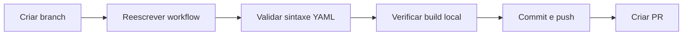

# 04 — Plano de Implementação

## Visão Geral

A implementação consiste em **reescrever** o arquivo `.github/workflows/opencode.yml` substituindo o workflow minimalista atual por um completo, seguindo a estrutura do repositório Rust original mas adaptado para Go.

## Tarefas

### Tarefa 1: Criar branch feature a partir de develop

**Descrição**: Criar branch `feature/opencode-workflow-go` a partir de `develop` e fazer checkout.

**Comandos**:
```bash
git checkout develop
git pull origin develop
git checkout -b feature/opencode-workflow-go
```

**Verificação**: `git branch` mostra `feature/opencode-workflow-go` ativa.
**Esforço**: Baixo
**Dependências**: Nenhuma

---

### Tarefa 2: Reescrever `.github/workflows/opencode.yml`

**Descrição**: Substituir o conteúdo atual do workflow pelo novo, contemplando todos os steps do mapeamento Rust → Go.

**Conteúdo do arquivo**:

```yaml
# opencode.yml — Workflow OpenCode para Go (gopayground)
#
# Adaptado do workflow original do repositório Daniel-Dos/rust-ai:
#   https://github.com/Daniel-Dos/rust-ai/blob/master/.github/workflows/opencode.yml
#
# Mapeamento Rust → Go:
#   dtolnay/rust-toolchain@stable → actions/setup-go@v6
#   docker run nats              → docker run kafka + docker run redis
#   cargo build                  → make build build-ui build-producer

name: opencode

on:
  pull_request:
    branches: [master]
    types: [opened, synchronize, reopened]
  issue_comment:
    types: [created]
  pull_request_review_comment:
    types: [created]

jobs:
  opencode:
    if: |
      github.event_name == 'pull_request' ||
      contains(github.event.comment.body, ' /oc') ||
      startsWith(github.event.comment.body, '/oc') ||
      contains(github.event.comment.body, ' /opencode') ||
      startsWith(github.event.comment.body, '/opencode') ||
      contains(github.event.comment.body, ' /run') ||
      startsWith(github.event.comment.body, '/run')
    runs-on: ubuntu-latest
    timeout-minutes: 30
    permissions:
      id-token: write
      contents: read
      pull-requests: write
      issues: write
      checks: write

    steps:
      # ──────────────────────────────────────────────
      # Step 1: Checkout do código-fonte
      # ──────────────────────────────────────────────
      - name: Checkout repository
        uses: actions/checkout@v6
        with:
          persist-credentials: false

      # ──────────────────────────────────────────────
      # Step 2: Setup Docker BuildKit
      # ──────────────────────────────────────────────
      - name: Setup Docker
        uses: docker/setup-buildx-action@v3

      # ──────────────────────────────────────────────
      # Step 3: Setup Go toolchain
      # Equivalente a: dtolnay/rust-toolchain@stable
      # ──────────────────────────────────────────────
      - name: Setup Go
        uses: actions/setup-go@v6
        with:
          go-version-file: go.mod
          cache: true

      # ──────────────────────────────────────────────
      # Step 4: Iniciar Apache Kafka (modo KRaft)
      # Equivalente a: docker run nats
      # ──────────────────────────────────────────────
      - name: Start Kafka
        run: |
          docker rm -f kafka-server 2>/dev/null || true
          docker run --rm -d \
            -p 9092:9092 \
            --name kafka-server \
            -e KAFKA_PROCESS_ROLES=broker,controller \
            -e KAFKA_NODE_ID=1 \
            -e KAFKA_CONTROLLER_QUORUM_VOTERS=1@localhost:9093 \
            -e CLUSTER_ID=opencode-cluster-$(date +%s) \
            -e KAFKA_CONTROLLER_LISTENER_NAMES=CONTROLLER \
            -e KAFKA_LISTENERS=PLAINTEXT://:9092,CONTROLLER://:9093 \
            -e KAFKA_ADVERTISED_LISTENERS=PLAINTEXT://localhost:9092 \
            -e KAFKA_LISTENER_SECURITY_PROTOCOL_MAP=CONTROLLER:PLAINTEXT,PLAINTEXT:PLAINTEXT \
            -e KAFKA_OFFSETS_TOPIC_REPLICATION_FACTOR=1 \
            -e KAFKA_AUTO_CREATE_TOPICS_ENABLE=true \
            apache/kafka:3.9.0

      # ──────────────────────────────────────────────
      # Step 5: Iniciar Redis
      # Equivalente a: docker run nats (segundo serviço)
      # ──────────────────────────────────────────────
      - name: Start Redis
        run: |
          docker rm -f redis-server 2>/dev/null || true
          docker run --rm -d \
            -p 6379:6379 \
            --name redis-server \
            redis:7-alpine

      # ──────────────────────────────────────────────
      # Step 6: Aguardar serviços ficarem prontos
      # ──────────────────────────────────────────────
      - name: Wait for services
        run: |
          echo "Waiting for Kafka..."
          for i in $(seq 1 30); do
            docker inspect kafka-server --format='{{.State.Status}}' 2>/dev/null | grep -q running && echo "Kafka is ready" && break
            echo "  attempt $i/30 - Kafka not ready yet"
            sleep 2
          done

          echo "Waiting for Redis..."
          for i in $(seq 1 15); do
            docker inspect redis-server --format='{{.State.Status}}' 2>/dev/null | grep -q running && echo "Redis is ready" && break
            echo "  attempt $i/15 - Redis not ready yet"
            sleep 2
          done

          echo "All services are running."

      # ──────────────────────────────────────────────
      # Step 7: Build do projeto (multi-alvo)
      # Equivalente a: cargo build
      # ──────────────────────────────────────────────
      - name: Build
        run: make build build-ui build-producer

      # ──────────────────────────────────────────────
      # Step 8: Executar agente OpenCode
      # ──────────────────────────────────────────────
      - name: Run opencode
        uses: anomalyco/opencode/github@latest
        env:
          OPENCODE_API_KEY: ${{ secrets.OPENCODE_API_KEY }}
        with:
          model: opencode/big-pickle
          prompt: |
            ${{ github.event_name == 'pull_request' && 'Execute o /run' || github.event.comment.body }}
            ${{ github.event_name != 'pull_request' && contains(github.event.comment.body, '/run') && 'Execute o /run' || '' }}
```

**Verificação**: Comparar visualmente com o workflow original para garantir equivalência semântica.
**Esforço**: Médio (20-30 linhas de YAML)
**Dependências**: Tarefa 1

---

### Tarefa 3: Validar sintaxe do workflow

**Descrição**: Validar que o YAML é sintaticamente correto.

**Opções**:
1. Usar `actionlint` localmente: `actionlint .github/workflows/opencode.yml`
2. Usar validador online: https://yamlchecker.com/
3. Submeter via `gh` e verificar status checks no GitHub

**Verificação**: Comando `actionlint` retorna sem erros.
**Esforço**: Baixo
**Dependências**: Tarefa 2

---

### Tarefa 4: Executar build local para verificar Makefile

**Descrição**: Garantir que `make build build-ui build-producer` funciona no ambiente de CI (Go toolchain configurada).

**Comando**: `make build build-ui build-producer`

**Verificação**: Binários `bin/consumer`, `bin/ui`, `bin/producer` são gerados sem erros.
**Esforço**: Baixo
**Dependências**: Tarefa 3

---

### Tarefa 5: Commit e push da branch

**Descrição**: Commitar as alterações no workflow e fazer push para o remoto.

**Comandos**:
```bash
git add .github/workflows/opencode.yml
git commit -m "feat(ci): adapt opencode workflow from Rust to Go

- Add Setup Go (actions/setup-go@v6) with module caching
- Add Start Kafka (apache/kafka:3.9.0, KRaft mode)
- Add Start Redis (redis:7-alpine)
- Add health check for services
- Add multi-target build (make build build-ui build-producer)
- Keep same triggers, permissions, condition, and prompt logic
- Equivalent to Daniel-Dos/rust-ai/.github/workflows/opencode.yml"
git push origin feature/opencode-workflow-go
```

**Verificação**: `git log --oneline -1` mostra o commit com a mensagem correta.
**Esforço**: Baixo
**Dependências**: Tarefa 4

---

### Tarefa 6: Criar PR via interface do GitHub

**Descrição**: Usar o `gh` CLI para criar um Pull Request da branch `feature/opencode-workflow-go` para `develop`.

**Comando**:
```bash
gh pr create \
  --base develop \
  --head feature/opencode-workflow-go \
  --title "[feature] Adapt opencode workflow from Rust to Go" \
  --body "## Descrição

Adaptação do workflow OpenCode do repositório \`Daniel-Dos/rust-ai\` para equivalente neste projeto Go.

### Mudanças
- Setup Go (actions/setup-go@v6) com cache de módulos
- Inicialização de Kafka + Redis como dependências de infraestrutura
- Build multi-alvo: \`make build build-ui build-producer\`
- Health check de serviços antes do build
- Mesma lógica de triggers, permissões, condição e prompt do original

### Como testar
1. Verificar CI passar (lint, test, build)
2. Comentar \`/oc run\` neste PR para acionar o agente OpenCode
3. Verificar steps no log do workflow"
```

**Verificação**: `gh pr view` mostra o PR criado com os detalhes corretos.
**Esforço**: Baixo
**Dependências**: Tarefa 5

---

## Resumo de Dependências



## Estimativa de Esforço

| Tarefa | Esforço | Responsável |
|--------|---------|-------------|
| T1 — Criar branch | Baixo (< 1 min) | Senior Engineer |
| T2 — Reescrever workflow | Médio (15 min) | Senior Engineer |
| T3 — Validar sintaxe | Baixo (2 min) | Senior Engineer |
| T4 — Verificar build | Baixo (5 min) | Senior Engineer |
| T5 — Commit e push | Baixo (2 min) | Senior Engineer |
| T6 — Criar PR | Baixo (2 min) | Senior Engineer |
| **Total** | **~27 min** | Senior Engineer |
